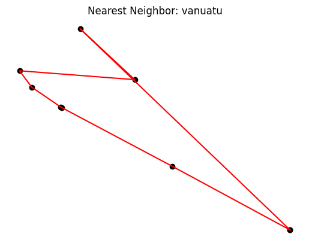
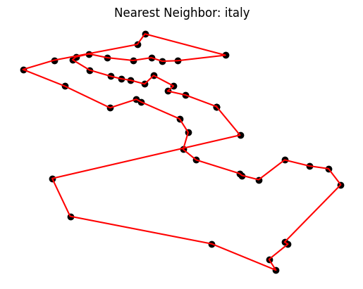
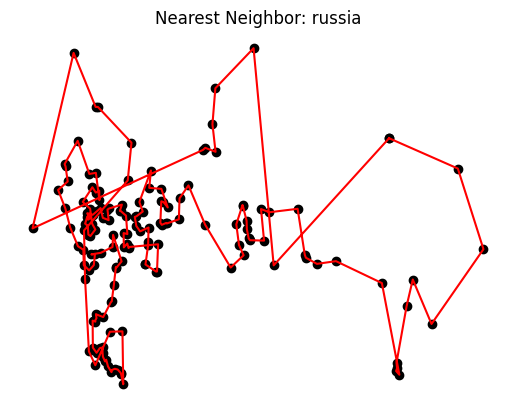
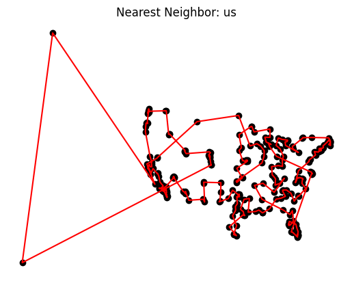
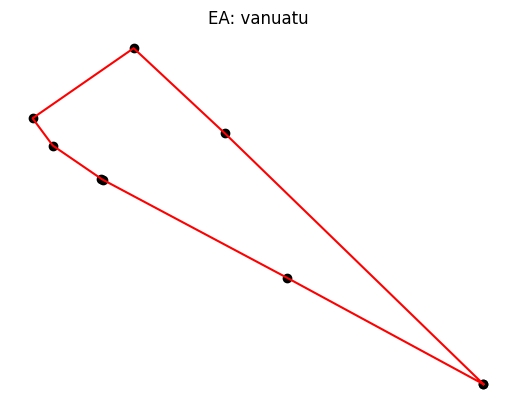
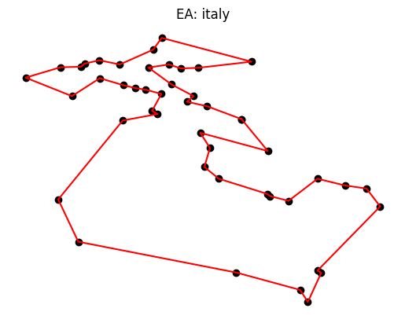
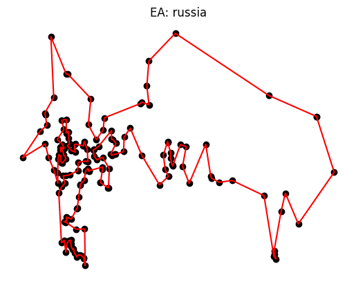
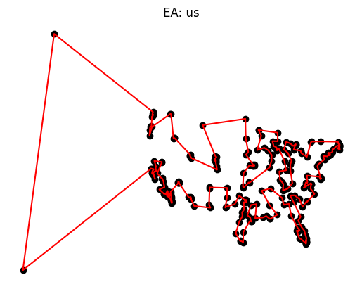
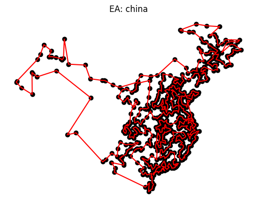

# 1. CI2024_lab2 - [The Traveling Salesman Problem]

- [1. CI2024\_lab2 - \[The Traveling Salesman Problem\]](#1-ci2024_lab2---the-traveling-salesman-problem)
  - [1.1. Lab's Objective](#11-labs-objective)
  - [1.2. The problem](#12-the-problem)
    - [1.2.1. Representation](#121-representation)
  - [1.3. Solution #1: Greedy Nearest Neighbor (NN) approach](#13-solution-1-greedy-nearest-neighbor-nn-approach)
    - [1.3.1. NN approach: results](#131-nn-approach-results)
    - [1.3.2. NN approach: conclusions](#132-nn-approach-conclusions)
  - [1.4. Solution #2: EA approach](#14-solution-2-ea-approach)
    - [1.4.1. EA approach: Method](#141-ea-approach-method)
    - [1.4.2. EA approach: Settings](#142-ea-approach-settings)
    - [1.4.3. EA approach: results](#143-ea-approach-results)
    - [1.4.4. EA approach: conclusions](#144-ea-approach-conclusions)
- [2. Credits](#2-credits)

## 1.1. Lab's Objective

> - Solve the given TSP instances using both a <u>fast but approximate algorithm</u> and a <u>slower, yet more accurate one</u>.
> - Report the final cost and the number of steps.

## 1.2. The problem

> *"Given a list of cities and the distances between each pair of cities, what is the shortest possible route that visits each city exactly once and returns to the origin city?"*

- [TSP solutions for the given countries - Wolfram](https://www.wolframcloud.com/obj/giovanni.squillero/Published/Lab2-tsp.nb).

The `optimal paths` are the following:

| Region  | #cities | Shortest_path (km) |
|---------|---------|--------------------|
| Vanuatu | 8       | 1345.54            |
| Italy   | 46      | 4172.76            |
| Russia  | 167     | 32722.5            |
| US      | 340     | 39016.62           |
| China   | 746     | ???                |

### 1.2.1. Representation

The cities' info is loaded form a csv file into a `Dataframe`.

> We can represent the solution as a list of city indexes. So it is a <u>fixed leght integer array</u> representation and more specifically I treated it as a `one-time item` list for the [EA apprach](#14-solution-2-ea-approach).

## 1.3. Solution #1: Greedy Nearest Neighbor (NN) approach

I started my research by re-implementing the simplest solution seen during the lectures.

- First, pick a random city from the avaible cities;
- Then, choose the nearest neighbor;
- Repeat until we cover all the cities.

The only thing I added was a <u>cycle to optimize the distance and get the optimum</u>.

```py
EPOCHS = 1000
tsp_sol, cost = _nn_approach(CITIES, DIST_MATRIX)
for i in range(EPOCHS):
    new_tsp_sol, new_cost = _nn_approach(CITIES, DIST_MATRIX)
    if new_cost < cost:
        tsp_sol = new_tsp_sol
        cost = new_cost
```

### 1.3.1. NN approach: results

<table>
    <tr>
        <th>Region</th>
        <th>Shortest_path (km)</th>
        <th>Optimal_path (km)</th>
        <th>Calls</th>
        <th>Graph</th>
    </tr>
    <tr>
        <td>Vanuatu</td>
        <td>1475.5281</td>
        <td>1345.54</td>
        <td>1001</td>
        <td></td>
    </tr>
    <tr>
        <td>Italy</td>
        <td>4436.0318</td>
        <td>4172.76</td>
        <td>1001</td>
        <td></td>
    </tr>
    <tr>
        <td>Russia</td>
        <td>40051.5870</td>
        <td>32722.5</td>
        <td>1001</td>
        <td></td>
    </tr>
    <tr>
        <td>US</td>
        <td>46244.3330</td>
        <td>39016.62</td>
        <td>1001</td>
        <td></td>
    </tr>
    <tr>
        <td>China</td>
        <td>62161.0910</td>
        <td>???</td>
        <td>1001</td>
        <td></td>
    </tr>
</table>

### 1.3.2. NN approach: conclusions

As we can tell this approach gives us a solution not so far off to the optimal <u>but we have no chance of improvement</u>.

## 1.4. Solution #2: EA approach

### 1.4.1. EA approach: Method
> I decided to use an `hyper-modern` approach for choosing the `genetic operators` with the following configurations:
> - `tournament parent selection`
> - `inversion mutation`
> - `invert over xover`

My algorithm goes as follow:

1. Create a `starting population` from the NN approach
2. Iterate for `MAX_GENERATIONS` steps every time getting the best solution

For each step:
1. Generate `OFFSPRING_SIZE` new solutions;
   1. for the chosen method perform a `tournament parent selection`.
      1. apply with `GEN_OP_PROBABILITY` `inversion mutation` 
      2. or else do `invert over xover`;
2. Add the new solutions to the population;
3. Let only the first `POPULATION_SIZE` solutions survive.

### 1.4.2. EA approach: Settings

I used the following configurations for `italy`, `russia`, `us` and `china`:

```py
POPULATION_SIZE = 100
OFFSPRING_SIZE = 1_000
MAX_GENERATIONS = 1_000
GEN_OP_PROBABILITY = .4
TOURNAMENT_SIZE = 3
```

### 1.4.3. EA approach: results

> <u>Note that these are the best results obtained so far running multiple times the algorithm</u>.

<table>
    <tr>
        <th>Region</th>
        <th>Shortest_path (km)</th>
        <th>Optimal_path (km)</th>
        <th>Calls</th>
        <th>Graph</th>
    </tr>
    <tr>
        <td>Vanuatu</td>
        <td>1345.5450</td>
        <td>1345.54</td>
        <td>80786</td>
        <td></td>
    </tr>
    <tr>
        <td>Italy</td>
        <td>4181.6200</td>
        <td>4172.76</td>
        <td>1000101</td>
        <td></td>
    </tr>
    <tr>
        <td>Russia</td>
        <td>34270.4990</td>
        <td>32722.5</td>
        <td>1000101</td>
        <td></td>
    </tr>
    <tr>
        <td>US</td>
        <td>39336.2276</td>
        <td>39016.62</td>
        <td>1000101</td>
        <td></td>
    </tr>
    <tr>
        <td>China</td>
        <td>54366.4977</td>
        <td>???</td>
        <td>1000101</td>
        <td></td>
    </tr>
</table>

### 1.4.4. EA approach: conclusions

In comparison with the [Greedy NN](#13-solution-1-greedy-nearest-neighbor-nn-approach), the new EA approach surely gets results much closer to the optimal.

During my researches I tryied different alternatives:
- implement a `modern approch` (check the [tsp](tsp.ipynb) file) of the genetic operators;
- an `instert mutation`;
- a `generational approach`.

In every case I always got worse reults, compared to the [current algorithm](#141-ea-approach-method).

To conclude, I would like to highlight that this algorithm can be improved extensively and needs more fine-tuning. In the future, I'd like to expand the code by adding alternative approches like new mutation or xover types, or even comparing the hyper-modern approach with the modern and classical one.

# 2. Credits

- Thanks to [Martina Plumari (s317612)](https://github.com/MartinaPlumari) who:
  - helped me understand how `invert-over crossover` works and how to easily implement it;
  - discussed with me possible solutions with `pros` and `cons`.
- Professor's `lectures` and `solutions`
  - Was a good start for understanding the basics, expecially for the lectures about EA and the labs where professor implemented the `set-covering with EA approach` and the `tsp greedy solution`.
- `Resources` found on-line:
  - [Travelling salesman problem - Wikipedia](https://en.wikipedia.org/wiki/Travelling_salesman_problem)
  - [What is the Traveling Salesman Problem? - Youtube](https://www.youtube.com/watch?v=1pmBjIZ20pE&ab_channel=AlphaOpt)
  - [The Traveling Salesman Problem: When Good Enough Beats Perfect - Youtube](https://www.youtube.com/watch?app=desktop&v=GiDsjIBOVoA&ab_channel=Reducible)